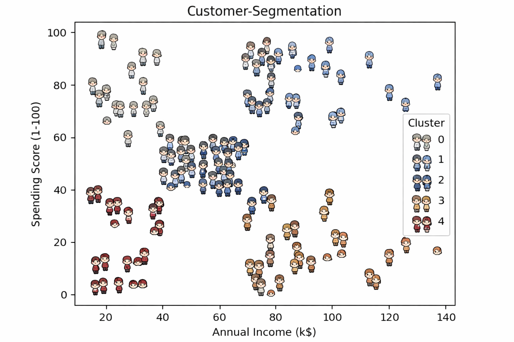

# 🛍️ Customer Segmentation using KMeans Clustering

## 📌 Project Overview

This project applies **unsupervised machine learning (KMeans clustering)** to segment retail customers based on their purchasing behavior and income levels.

The objective is to identify meaningful customer groups that can help businesses design targeted marketing strategies instead of using a one-size-fits-all approach.

---

## 📊 Visualization

Below is the final clustering result based on Annual Income and Spending Score:

The scatter plot shows clearly separated customer segments formed using KMeans clustering.

---

## 🎯 Business Problem

Retail businesses often face challenges such as:

- Generic marketing campaigns
- Poor customer targeting
- Low conversion rates
- Inefficient marketing spend

Without segmentation, all customers are treated equally, which reduces overall ROI.

This project solves that problem by identifying distinct customer behavior patterns.

---

## 📂 Dataset

**Source:** Mall Customer Segmentation Dataset (Kaggle)

### Features Used:
- Annual Income (k$)
- Spending Score (1–100)

---

## ⚙️ Methodology

1. Exploratory Data Analysis (EDA)
2. Feature Selection
3. Data Scaling using StandardScaler
4. Optimal Cluster Selection (Elbow Method + Silhouette Score)
5. KMeans Model Training
6. Cluster Interpretation

---

## 🔍 Cluster Interpretation

The model identified **5 distinct customer segments**:

### 🟢 High Income – High Spending
Premium customers contributing significantly to revenue.  
Focus: Retention & loyalty programs.

### 🔵 High Income – Low Spending
High purchasing power but low engagement.  
Focus: Upselling & personalized campaigns.

### 🟡 Low Income – High Spending
Promotion-driven customers.  
Focus: Discount campaigns & offers.

### 🟣 Low Income – Low Spending
Low engagement & limited revenue contribution.  
Focus: Minimal marketing investment.

### 🟤 Mid Income – Moderate Spending
Stable segment with growth potential.  
Focus: Cross-selling & nurturing strategies.

---

## 💼 Business Impact

This segmentation enables businesses to:

- Improve Marketing ROI
- Reduce Customer Acquisition Cost
- Increase Customer Lifetime Value (CLV)
- Implement Personalized Campaigns
- Optimize Budget Allocation

---

## 🛠️ Tech Stack

- Python
- Pandas
- NumPy
- Matplotlib
- Seaborn
- Scikit-learn

---

## 📈 Why KMeans?

KMeans was chosen because:

- The clusters are convex and well-separated.
- Data contains minimal noise/outliers.
- Clear grouping structure visible in feature space.
- Silhouette score validated cluster quality.

---

## 🚀 Future Improvements

- Include Age and behavioral features
- Deploy interactive dashboard using Streamlit
- Compare with DBSCAN & Hierarchical Clustering
- Integrate churn prediction model
- Deploy as an API for real-time segmentation

---

## 🧠 Conclusion

Customer segmentation is a powerful analytical tool.

By leveraging unsupervised learning, businesses can move from intuition-based decisions to data-driven strategies, leading to better targeting, higher engagement, and improved revenue growth.
